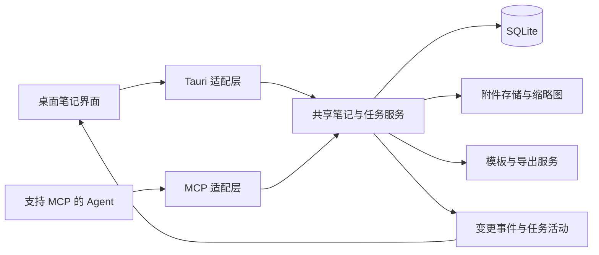
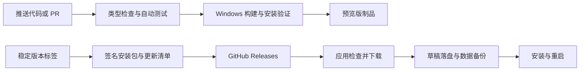

# DevPad 重构评估与产品设计草案

## 1. 文档信息与评估边界

- 日期：2026-10-07，Asia/Shanghai。
- 当前版本：0.6.5；本文版本：0.1，待讨论的设计草案。
- 输入：当前项目源码、README、已有设计与资源审计、用户截图、公开产品帮助文档和协议规范。
- 本轮完成：架构与交互审查、运行进程只读采样、现有前端检查与测试、重构方案。没有修改应用源码、数据库、剪贴板、自启设置，也没有创建或推送 GitHub 仓库。
- 静态截图只能证明截图中的布局；动效判断结合组件源码，不冒充动态体验测试。仓库内早期截图只用于理解演进，当前行为以 0.6.5 源码为依据。
- 竞品参考来自官方公开文档及 UX 研究，不代表取得这些公司的内部 PRD，也不声称存在客观唯一的“最好产品”。

## 2. 核心判断

底层选型值得保留，产品模型和应用边界值得重构。建议定位为“本地优先的图文笔记本，可选择把内容交给 Agent 执行”。

当前体验中的复杂性有明确来源：每条笔记必须属于项目，默认类型为 Bug，所有保存记录都有 Open/Done 状态；默认复制会生成开发任务指令；多窗口和交付批次让用户承担草稿、快照、状态和附件配套管理。它适合开发反馈收集，却把普通笔记也拉进了工程流程。

建议普通笔记没有任务状态。需要执行的内容单独建立任务，任务可以引用一条或多条笔记，并拥有领取、进度和结果。编辑笔记、导出内容、发布任务三件事具有独立语义。

优先解决数据可靠性、原文忠实性和 MCP 任务闭环；界面改造围绕这些行为展开。

## 3. 架构与轻量程度

### 当前技术结构

| 层 | 实现 | 判断 |
| --- | --- | --- |
| 桌面外壳 | Tauri 2，Windows WebView2 | 不是 Electron；复用系统 WebView，适合保留 |
| 界面 | Svelte 5、TypeScript、Vite | 运行依赖少，暂时没有换框架的依据 |
| 本地逻辑 | Rust，Tauri 命令与窗口事件 | 数据与附件能力可复用，需抽取独立服务 |
| 数据 | SQLite/rusqlite，WAL；记录主体为 JSON payload | 小规模简单可靠，大量查询和多客户端写入需加强 |
| 图片 | 本地文件，元数据包含绝对路径 | 与数据库分离合理，路径迁移和回收不足 |
| 剪贴板 | arboard、clipboard-win | 文本与图片文件列表为不同操作 |
| 发布 | 手工构建 EXE，bundle.active=false | 尚未形成安装、签名更新和自动发布链路 |

源码依据：[package.json](../../package.json)、[Cargo.toml](../../src-tauri/Cargo.toml)、[tauri.conf.json](../../src-tauri/tauri.conf.json)、[main.rs](../../src-tauri/src/main.rs)。Tauri 的系统 WebView 和多进程模型见[官方架构说明](https://tauri.app/concept/process-model/)。系统 WebView2 自身的安装体积不包含在 EXE 内。

### 已测数据及其含义

| 项目 | 结果 | 能说明什么 |
| --- | ---: | --- |
| release/DevPad-0.6.5.exe | 8,760,320 字节，约 8.35 MiB | 发布程序体积轻 |
| 当前源码构建的 JS | 140.01 kB，gzip 49.90 kB | 前端包并不大；不等于运行内存 |
| 当前源码构建的 CSS | 40.88 kB，gzip 8.36 kB | 没有明显的依赖体积问题 |
| 运行进程 | DevPad + 6 个 WebView2 子进程 | 不能只统计主 EXE |
| 全部进程私有提交量 | 234.24 MiB | 内存成本具有优化价值；不是独占物理 RAM |
| 工作集简单求和 | 293.15 MiB | 包含可能重复的共享页，不等同于独占 RAM |
| 5.02 秒采样的 CPU | 未测到累计 CPU 时间增长 | 当前短时状态没有观察到忙循环，不能证明所有使用场景 |

运行采样时间为 2026-10-07 18:01:18；没有切换或隐藏窗口，当前窗口数、数据量和用户活动未做控制。没有测当前版本的私有驻留量、GPU、冷启动、多图峰值、持续编辑、万条笔记或长期泄漏。

旧的 [resource-audit.md](../resource-audit.md) 在 0.4.0、小数据量下记录约 100 MiB 私有驻留量，以及收进托盘前后几乎不变。它可以说明历史问题，不能直接作为 0.6.5 的性能结论。

结论：安装体积轻，技术路线合理，当前短时 CPU 表现正常；常驻资源并非极低。日常小规模使用有基础，但目前没有足够证据保证大量图文和长时间运行的性能。

## 4. 使用人群与产品目标

主要用户是同时进行普通记录和 Agent 协作的个人用户。其首要需求是快速记下文字和图片、以后能找回、原样交付；不需要在开始输入前理解项目管理术语。

目标：

1. 打开即可记录，项目与分类可事后整理。
2. 笔记关闭、应用重启和异常退出后，已持久化内容能恢复。
3. 原文复制与导出保持内容，不自动增加执行指令。
4. 需要执行时，Agent 能发现、领取、获取图文、汇报、完成或释放任务。
5. 有帮助、版本信息、数据备份与可信更新，使它能够长期使用。

产品不必因接入 MCP 而内置模型、购买 AI API 或承担 Agent 的代码执行环境。Agent 在自己的环境执行，DevPad 管理内容和协作状态。

## 5. 关键场景

| 场景 | 建议流程 | 应看到的反馈 |
| --- | --- | --- |
| 随手记一句话 | 新建 → 输入 → 自动保存 | 保存中 / 已保存 / 保存失败 |
| 图文混排 | 输入文字 → 粘贴图 → 继续输入 | 图片出现在光标处，顺序保持 |
| 普通笔记整理 | 搜索 / 加标签 / 移动到笔记本 | 原内容和当前位置明确 |
| 单条快速复制 | 复制正文 | 不加入项目、状态、批次或执行要求 |
| 多条完整交付 | 多选 → 导出 → 选格式或模板 | 条目数、图片数、顺序、范围明确 |
| 发布可执行任务 | 选笔记 → 设任务目标 → 发布 | 原笔记保留，任务进入可领取列表 |
| Agent 自主接任务 | list_tasks → claim_task → 获取内容 → 执行 → complete_task | UI 显示执行者、进度和结果 |
| 关闭或更新应用 | 草稿落盘 → 保存状态确认 → 关闭或重启 | 成功保存无需逐窗口确认，失败保留内容 |

其中任务发布是明确动作；创建普通笔记不会自动变成可执行任务。

## 6. 现有交互的问题与建议

| 问题 | 现状证据 | 改进 |
| --- | --- | --- |
| 创建前需要组织 | 没有 projectId 时要求先建项目 | 内置收件箱，默认普通笔记，稍后整理 |
| 普通记录默认工程语义 | App.svelte 默认 Bug、save 默认 Open | 默认 Note；任务状态属于 Task |
| 复制语义不清 | 默认复制 Agent 提示词，图标悬停由 copy 变 send | 固定复制图标；“复制正文”“导出”“发布任务”明确命名 |
| 鼠标目标移动 | CopyControl 悬停向左展开 1–2 个按钮 | 固定主按钮 + 点击下拉；不挤占标题或移动命中位置 |
| 提示遮挡内容 | 提示条在按钮下方即时出现 | 延迟提示，避开正文；动作必须可凭按钮名称理解 |
| 保存打断连续记录 | 保存成功关闭编辑窗口，新建又开一个窗口 | 默认主窗编辑并自动保存；独立窗口作为显式选项 |
| 草稿与窗口绑定 | 草稿在内存；返回列表隐藏窗口；有“已打开笔记”管理 | 草稿持久化，窗口只承载视图 |
| 退出确认繁琐 | 退出时逐个检查未保存编辑窗口 | 自动保存成功直接退出；保存失败统一列出受影响笔记 |
| 大小变化改变容器 | 项目/筛选在侧栏与原生辅助窗口之间转换 | 默认稳定的主窗内侧栏或面板；小窗隐藏低频控件 |
| 批量工具拥挤 | 提示词、图片、原文、移动、完成、恢复、删除同时显示 | 主栏只显示数量、复制/导出、更多；任务批量操作放任务视图 |
| 复制顺序不统一 | 主列表新到旧，Agent 快速导出旧到新；原文依 selected 顺序 | 默认按当前显示顺序；所有格式共用同一内容清单 |
| 修改筛选清空选择 | filterKey 变化重置 selected | 第一版仍限定当前视图；明确告知“更改筛选会清空选择”，不要悄悄扩展跨页操作 |
| 笔记状态与交付混淆 | 复制、查看快照、标记完成互相靠近 | 复制只读；任务领取和完成有独立结果与活动记录 |
| 删除只能确认 | 删除数据库记录且不可撤销 | 回收站 + 撤销；永久清空才确认 |
| 图片标注保存两次 | 应用标注另存图，再保存笔记 | 已应用标注随自动保存持久化；保留原图与撤销来源 |
| 错误重试缺乏针对性 | 通用错误“重试”调用 refresh | 对保存、导出、连接等提供对应重试，保留操作输入 |

截图中可见的动作拥挤、提示条遮挡与源码中的悬停展开一致；不能从一张静态图断言帧率或鼠标操作实际耗时。建议移除这类移动操作目标的动画，保留轻微淡入和保存反馈；悬浮收起默认关闭，作为可选高级功能。

关于用户提到的“待处理确认”：当前 batch(Open/Done) 本身没有确认框；确认主要出现在放弃编辑、退出、删除和标注关闭。它可能指状态入口繁琐，或某条完整工作流中的确认。重构应同时解决普通笔记强制状态和草稿确认，后续验收按具体动作核对，不虚构一处不存在的状态确认。

## 7. 成熟产品可借鉴的处理逻辑

| 参考 | 公开做法 | DevPad 采用的原则 | 本次不引入的复杂度 |
| --- | --- | --- | --- |
| Obsidian | 本地 Markdown、附件文件、可选模板 | 内容可带走、附件有稳定引用、模板主动选择 | 知识图谱、插件市场、双向文件同步 |
| Bear | 单条/多条导出、多种格式、可调整导出选项 | 统一导出入口，把内容范围与格式选择放在一起 | 一开始支持大量文档格式 |
| Linear | 问题所有权与 Agent 委派分开，活动与结果可见 | 任务可领取、有执行者、有回写结果，用户保留控制 | 团队管理、迭代、工时、复杂看板 |
| NN/g | 高频操作直接显示，低频复杂选项渐进展开 | 主界面先服务记录与查找，高级导出和集成进入次级面板 | 多层向导、靠悬停发现核心操作 |

依据：[Obsidian 数据存储](https://obsidian.md/help/data-storage)、[附件](https://obsidian.md/help/attachments)、[模板](https://obsidian.md/help/plugins/templates)、[Bear 导出说明](https://bear.app/faq/export-your-notes/)、[Linear Agent](https://linear.app/docs/agents-in-linear)、[委派](https://linear.app/docs/assigning-issues)、[NN/g 渐进披露](https://www.nngroup.com/articles/progressive-disclosure/)、[动画设计](https://www.nngroup.com/articles/animation-usability/)。表中的 DevPad 决策是针对本项目的设计推论。

主界面建议：收件箱、笔记本、标签、可选任务入口；中央笔记列表；主窗内打开编辑器。新建、搜索、复制/导出直接可达。设置内按外观、导出模板、Agent 连接、数据、更新分组；帮助保持独立可发现入口。

“笔记”和“任务”采用同一套内容与搜索能力，避免两个割裂的应用模式。

## 8. 内容、复制与模板规格

### 当前“夹带私货”的来源

[core.ts 的 compose](../../src/core.ts) 固定加入“本轮开发上下文”、交付批次、去重与冲突处理、统一实施与验证要求、Done 只作背景、图片识别规则，以及每条记录的类型、短 ID、状态和标签。默认 raw 分支只复制 text，不包含图片。

这不是外部 Agent 自行增加的内容，而是 DevPad 当前内置的导出策略。部分规则在工程任务中有价值，但应成为可选择的模板。

### 默认和预设

| 预设 | 内容 | 状态/标签/项目 | 执行要求 | 图片处理 |
| --- | --- | --- | --- | --- |
| 原文 | 所选正文，按明确顺序连接 | 默认无 | 无 | 正文复制只含文字；完整导出保留原图 |
| 图文资料 | 正文 + 图片与所属位置映射 | 默认无 | 无 | 稳定附件 ID 和相对引用 |
| 讨论分析 | 原始资料 + 用户配置的讨论目标 | 按需 | 分析/回答，由模板明确提供 | 同上 |
| 工程任务 | 任务目标、正文、可选背景、验收条件 | 按需 | 实施、验证等显式配置 | 可选导出编号衍生图 |

模板可新建、复制、命名、设默认、编辑和预览。建议初始变量：content、attachments、image_map、project、tags、task_goal、acceptance_criteria；高级批次变量仅在需要配套导出时提供。

模板编辑器提供变量插入菜单和样例预览；缺失必填变量时指出缺什么，不输出未替换占位符，也不自动猜值。模板第一版为文本与有限条件块，不执行任意脚本。

元数据和规则作为独立可选段落，包括“带上状态”“带上项目”“展开引用”“添加图片匹配说明”。普通笔记默认不展开引用；任务背景可以显式加入。跨笔记本引用必须在范围清单中可见。

### 图文数据模型必须补足

当前 Entry 把 text 与 attachments 分开保存，无法表达“文字 A → 图 1 → 文字 B → 图 2”的混排位置。仅修剪贴板按钮不能恢复不存在的顺序信息。

建议新的正文具有有序内容块：文本块与图片引用块。图片块引用稳定 attachment_id，Markdown/HTML 导出时生成相对引用。SQLite 保持唯一权威数据源，Markdown 是可移植导出格式；第一版不做两套可同时写入的存储。

旧记录迁移时将 text 保留为文本块，随后追加旧附件列表；保留原顺序和原始 payload 备份，不猜测旧图片的插入位置。

### 复制与完整导出的能力边界

Windows 可以一次发布文本、HTML、文件列表等多种格式，但接收方选择自己理解的格式。多种格式通常是同一内容的不同表示，不保证目标将它们合并成多图与文字。见[微软剪贴板格式](https://learn.microsoft.com/en-us/windows/win32/dataxchg/clipboard-formats)。

第一版定义三种明确能力：

1. 复制正文：忠实文字，不附带策略；只读操作。
2. 复制图文：可写入 HTML、纯文本回退和图片文件列表；仅对经过验证的目标说明支持情况。复制成功只意味着剪贴板写入成功。
3. 完整导出：Markdown + 图片 + manifest 的文件夹或 ZIP，包含顺序、归属、版本和校验值；普通图文资料可使用 TextBundle 思路。保留源图片，编号图仅为可选衍生产物。

MCP 是 Agent 获取完整内容的主要通道，手工导出作为兼容路径。小图可直接返回图片内容块，大图按需获取预览或原件；不能只给一个 Agent 无法访问的 Windows 路径。

## 9. 重构后的技术与数据边界

保留 Tauri/Svelte/Rust/SQLite。将 App.svelte 的编辑、列表、选择、导出、任务和窗口状态拆开；Rust 的领域逻辑不依赖 WebviewWindow，Tauri 命令和 MCP 工具调用同一服务。

建议独立概念：

- Note：内容、笔记本、标签、revision、归档/删除时间；普通笔记无 Open/Done。
- Attachment：稳定 ID、相对存储键、原名、MIME、尺寸、大小、内容校验、缩略图与原图关系。
- Task：目标、引用的笔记、任务状态、模板、发布内容版本、完成要求。
- TaskRun：执行者、领取 token、lease 截止时间、进度、结果、失败原因、相关证据。
- ExportTemplate：文本、变量定义、配置版本。
- Draft/Revision：持久化编辑恢复和冲突检查。保存成功和任务发布是两个不同事实。

数据库采用可查询的状态、时间、revision 等列，内容块可保留 JSON；按查询建立索引，全文搜索再采用 FTS。附件使用相对存储键，路径由服务解析；迁移时校验旧文件确实位于附件根目录。

当前 save_entry 整体覆盖 payload，没有基于 revision 的冲突检测。MCP 引入后必须补 optimistic concurrency：expected_revision 不匹配时返回冲突及最新版本，不能覆盖用户的新编辑。状态更新、领取、完成、事件写入都由服务事务处理。

当前 db-changed 由前端 emit。新增 MCP 写入后，应由后端提交成功后发出变更事件；UI 按受影响记录增量更新。

桌面运行时由现有 Rust 进程承载服务；本地 stdio 桥通过命名管道或受保护的本地连接访问服务。桥接工具不再直接写数据库。需要 UI 关闭仍工作时，可提供无界面的 service 模式，并用单实例机制保证同一数据目录只有一个服务拥有者；它是可选启动能力，不强制安装系统常驻服务。

## 10. MCP 与任务流转规格

DevPad 应作为 MCP Server 暴露能力。无需为了被 Agent 调用而成为 MCP Client。

标准入口包括本地 stdio 和 Streamable HTTP。第一阶段优先本地 Agent；按实际目标客户端提供可复制的连接配置和“测试连接”。本地 HTTP 如启用，应限定本机、验证凭据和 Origin。远程或云端 Agent 需要另外部署可访问且鉴权的服务；127.0.0.1 和本地盘符无法自动跨机器访问。

协议实现使用维护中的 SDK，固定发布依赖版本，并测试目标客户端支持的协议修订；不要仅凭“符合最新规范”承诺全部客户端兼容。标准参考：[传输](https://modelcontextprotocol.io/specification/latest/basic/transports)、[工具](https://modelcontextprotocol.io/specification/latest/server/tools)、[资源](https://modelcontextprotocol.io/specification/latest/server/resources)。

建议首批工具：

| 工具 | 作用 | 关键约束 |
| --- | --- | --- |
| list_notes / get_note | 查找和读取授权范围内的笔记 | 分页、按需返回正文与附件摘要 |
| create_note / update_note | 写入普通笔记 | revision 与幂等键；默认不允许任意覆盖 |
| get_attachment | 获取图片预览/原件 | 使用附件 ID；支持图片内容块，限制返回大小 |
| list_tasks | 查找可领取、进行中或需帮助的任务 | 只列显式发布且授权的任务 |
| claim_task | 原子领取指定任务 | 返回 claim_token、lease、内容版本 |
| get_task_context | 读取本次发布的正文、图片和背景 | 返回结构化清单；可按需读取图像，不默认塞满上下文 |
| report_progress | 汇报进度、受阻或需要输入 | 验证领取 token；进度不改写原笔记 |
| complete_task | 提交结果、验证说明和产物引用 | 检查版本、token、完成要求和幂等键 |
| release_task | 主动释放失败或暂停的任务 | 必须记录原因，保留已有进度 |

模板可通过 MCP Prompts 暴露给支持它的客户端；普通读取工具仍返回中性结构化数据，不强制套用工程提示词。仅返回资源 URI 不足以覆盖所有客户端，因此保留 get_attachment 的工具读取路径。

MCP 规定了通信与工具形式，不替 DevPad实现任务调度，也不会自动唤醒所有 Agent。要持续自动接任务，Agent 侧必须在运行，并具有一次性工作指令、调度循环或可用事件订阅。首版支持 Agent 主动查询领取，之后才评估常驻调度。

建议任务状态：可领取 → 进行中 → 已完成；辅以受阻和取消。需要人工验收的任务可配置“Agent 提交结果 → 待验收 → 完成”，普通任务允许提交后完成，避免强制增加确认。

领取在事务内检查并写入，两个 Agent 同时领取只能一个成功。租约超时标记运行失联，可重新领取；超时不能被当成完成。旧 token 提交无效。lease 是业务任务租约，不依赖 MCP 连接会话。

执行者对外部仓库的操作无法仅由数据库租约完全隔离，所以重领时应显示已有运行和产物，Agent 执行前检查；重领不能暗示外部执行严格 exactly-once。

任务发布保存稳定版本。用户后来编辑笔记时，显示“原笔记有更新”；默认不悄悄改变执行中的任务。显式更新任务上下文产生新 revision，并让执行者确认继续或重新领取。

用户可按笔记本设置读取、记录创建、任务领取和结果提交范围；个人已授权工作流不需要每次领取弹确认。永久删除、发布安装包等不属于普通任务读取权限。调用记录提供可见的活动，授权控制放在连接设置中。

## 11. 性能与可靠性优化

按收益排序：

1. **减少窗口和重复加载。** 默认主窗编辑；设置、导出用主窗内面板，独立便签按需打开。当前每个辅助 App 实例都 load 全部数据，并监听 db-changed 后整体重载。
2. **分页与虚拟列表。** 当前 load 无 WHERE/LIMIT，全量解析 JSON，前端过滤和排序，visible 全量渲染。把检索下推数据库，避免小窗承担全部记录。
3. **图片缩略图与按需原图。** 当前 lazy 图片使用原文件地址；lazy 不能让解码后的图片自然变小。为列表生成缓存缩略图；原图仅在预览、标注或导出时读取。
4. **共享索引和轻量指纹。** 引用解析多次 all.find，chosen 使用 includes，复制快照频繁深拷贝与 JSON.stringify。建立 ID Map/Set，按 revision 缓存，限制 quickSessions 的数量与有效期。
5. **降低编辑 IPC。** 当前编辑状态反应式发送 editor_dirty，包含完整内容指纹；可只发送 dirty/busy/revision，合并短时间内重复变更。
6. **后台资源策略。** 草稿持久化之后，关闭不需要的辅助视图，评估隐藏 WebView 的节流/暂停或重建；验证恢复延迟后再决定，不把“隐藏窗口”当成释放资源。
7. **附件与导出生命周期。** 引用清单同时覆盖保存笔记、草稿、回收站和任务快照。未引用图片经过宽限期回收；临时 exports 有容量与过期策略，剪贴板仍引用的文件不能立即删。
8. **图片导入减少复制。** 当前拖入图片经 Base64 IPC，标注会以完整图片重绘；大图需设置尺寸/解码限制、按需缩放，并评估二进制或文件导入路径。
9. **按时唤醒。** 关闭悬浮模式时停止不必要的时钟；当前 start_clock 仍每秒唤醒一次。它不是已经证实的高 CPU 根因，优先级低于前几项。

建议验收基准而非已达到指标：固定一台参考 Windows 设备，构造 1 万条笔记、含缩略图与少量 4K 原图，搜索与首屏可操作 p95 < 200 ms；输入中避免 > 50 ms 的主线程长任务；本地元数据 MCP 读取 p95 < 100 ms（不含大图传输）。这些目标需根据设备与实际数据校准。

常驻内存先记录私有驻留量、提交量、GPU 和窗口数的可重复基线，再制定下降目标；不能拿本轮工作集相加数字声称独占 RAM 已优化。测试主窗、托盘、单编辑器、多个图片预览、批量导出和 8 小时持续使用。

自动保存建议在短暂停顿后提交，并在失焦/关闭前等待持久化。失败时明显保留输入和重试，不显示“已保存”。异常终止的恢复必须用隔离进程测试，而不能由正常关闭测试代替。

## 12. 功能取舍与待定事项

| 决策 | 功能 |
| --- | --- |
| 保留 | 本地数据、图片粘贴拖放、多选、搜索标签、主题、可选置顶、图片标注 |
| 重做 | 默认输入与自动保存、复制/导出、模板、任务语义、数据迁移、错误反馈 |
| 新增核心 | MCP、原子领取与结果回写、草稿恢复、回收站、帮助、更新 |
| 收到高级设置 | 独立窗口、悬浮收起、图片批次编号、状态/项目导出、开发专用模板 |
| 合并概念 | Draft 作为特殊笔记类型可逐步迁移为“引用集合/上下文包”，保留旧内容和引用关系 |
| 移除默认行为 | Bug 默认类型、普通笔记待处理/已完成、固定工程前言、悬停展开复制、复制即交付的暗示 |
| 暂不加入 | 团队账号、多用户云同步、插件市场、知识图谱、复杂看板、内置 Agent 执行沙箱 |

暂定采用 SQLite 唯一数据源、普通笔记默认、任务需显式发布、本地 MCP 优先、稳定版人工发版本。后续决策只需影响必要范围：

- 最先验收的 Agent 客户端有哪些，其本地/远程运行位置和多图支持怎样？
- 一般任务允许 Agent 直接完成，哪些任务需要人工验收？
- 是否需要 Markdown 文件双向编辑？如果只是可带走，先做完整导出即可。
- GitHub 发布文件需要公开还是私有？公开制品与私有源码可以分开；私有下载不能把长寿命仓库令牌写进客户端。
- 稳定版默认提示更新，是否允许自动下载并在下次启动安装？

这些事项不阻止当前阶段明确领域模型与修复复制忠实性，不应被变成新建笔记时的表单。

## 13. 分阶段实施与验收

### A：建立可迁移基础

先备份现有数据库与附件，建立代码版本库、领域服务、类型化数据与 revision，验证迁移；保留现有桌面适配层，使每步都可运行。自动保存、回收站、统一复制清单与 MCP 可在此基础上展开。

### B：MCP 最小闭环（本次首要新能力）

实现本地连接、list/get、图片读取、任务发布、claim、progress、complete/release；首批客户端实际测试。先以一个任务和两张图片走通，再测并发与内容版本变化。

### C：记录与导出体验

建立收件箱、主窗编辑、有序图文、模板预览与完整导出。移除默认工程前言和悬停移动按钮，简化批量栏。自动保存与草稿恢复需要在窗口资源优化前完成。

### D：发布和常驻优化

签名安装更新、帮助、备份恢复、附件回收、列表和图片优化。发布基础在 A 阶段就开始建设，不能等功能全部完成后才做 CI。

关键验收：

| Given / When | Then |
| --- | --- |
| 一条包含 Open 字样的普通笔记 / 复制正文 | 完全保留原字样，不加入新的状态段或指令 |
| 三条笔记、五张图 / 完整导出 | 所有正文和五个图片引用齐全，顺序、归属与清单一致 |
| 文字 A、图 1、文字 B、图 2 / 编辑、重启、导出 | 混排顺序保持，源图文件不被编号规则改写 |
| 原文模板 / 未勾选元数据 | 不产生状态、项目、去重、实施或验证指令 |
| 模板引用必填变量 / 缺少目标 | 明确显示缺失变量，不能导出半替换结果 |
| 两个 Agent 同时 claim 同一任务 | 只有一个成功，另一个收到可恢复的已领取结果 |
| 同一个提交重试 / 网络或进程中断 | 幂等，不重复完成或追加重复结果 |
| 用户编辑了笔记 / 旧版本 Agent 提交 | 不覆盖新正文，保留任务快照，明确版本关系 |
| 租约超时后重新领取 / 旧 Agent 再提交 | 旧 token 拒绝，既有活动与产物仍可追溯 |
| 已持久化草稿 / 隔离进程强制终止 | 重启后恢复已写入内容，未写入边界有明确说明 |
| 一条保存失败 / 用户关闭应用 | 不假报已保存，保留内容并聚焦失败笔记 |
| 删除后撤销 / 回收站恢复 | 正文、图片与任务关联恢复，不仅恢复文字 |
| 客户端不支持多图粘贴 / 点击复制图文 | 帮助有准确支持说明，完整导出和 MCP 仍可取到资料 |

本轮现有检查：svelte-check 0 错误、0 警告；9 个核心测试通过；前端构建通过；现有无界面 UI 验收通过。UI 验收验证布局、复制展开、滚动关闭菜单与批量移动，无法证明这些交互设计合理，也不验证真实 Agent 多图接收。没有运行会操作日常桌面鼠标/剪贴板的原生测试。

## 14. 帮助、CI/CD 与自动更新

帮助入口提供快捷键、复制与完整导出区别、模板变量、MCP 配置与连接测试、数据位置、备份恢复、版本及常见错误。首次使用只解释记录、导出和任务三个动作，高级内容按需阅读。

更新入口显示当前版本、检查结果、发布说明、下载进度和安装/稍后选择。失败不阻断记笔记；自动下载与自动安装分开配置。更新前保存草稿并检查活动任务，不能静默重启正在服务 Agent 的实例。

当前目录没有 .git，也没有 .github/workflows，未能读取到 Git remote；构建脚本手动执行 check/test/tauri build --no-bundle，配置 bundle.active=false。当前不能仅靠“推送源码”让旧 EXE 自动更新。

建议完整链路：

普通 push/PR 执行 CI；稳定 tag 或明确的发布流程执行 CD。个人用户可选主分支自动发布预览版，稳定通道保持可控，避免每次小改动强制更新。

Windows 第一版建议正式的用户级 NSIS 安装路径，便携版另行保留。引入 Tauri updater，生成更新制品、签名和 latest.json，签名私钥由发布环境管理，客户端只内置公钥。官方支持通过静态 JSON/GitHub Releases 提供更新；更新签名不可关闭。见[Tauri updater](https://v2.tauri.app/plugin/updater/)和[GitHub 流水线](https://v2.tauri.app/distribute/pipelines/github/)。

Tauri 更新签名和 Windows Authenticode 是不同机制：前者验证更新可信性，后者涉及系统识别发布者。更新时备份使用 SQLite 一致性备份能力，不能在 WAL 运行中只复制一个数据库文件。数据库迁移有版本与失败恢复；二进制降级要检查旧版本能否读取新库，不能承诺任意一键回退。

发布升级还需一次启动迁移：用户从当前旧 EXE 进入包含更新器的新安装版，沿用 local.devpad.desktop 数据标识并迁移原路径。旧版没有更新入口，首次跨越不能自动凭空完成。

CI 需要消除测试脚本中 C:/Users/ZHP/... 等机器特定路径，固定依赖与运行环境；无界面测试与原生测试分层。发布验证覆盖从上一版安装升级、草稿恢复、附件仍可访问、MCP 服务重连和签名失败时保留旧版。新版模板行为变化不得自动改写原笔记或把所有旧笔记发布为任务。

## 15. 代码定位与后续设计文档规则

关键依据：

- [core.ts](../../src/core.ts)：Entry、引用展开、交付快照、默认 compose 前言与元数据。
- [CopyControl.svelte](../../src/CopyControl.svelte)：默认 Agent 复制、悬停/焦点展开、图标变换、提示条。
- [App.svelte](../../src/App.svelte)：默认 Bug、Open 保存、全量 refresh、辅助窗口、确认流程、批量操作与 UI。
- [main.rs](../../src-tauri/src/main.rs)：load 全量读取、payload 覆盖、数据库模式、剪贴板格式、附件与迁移。
- [delivery.rs](../../src-tauri/src/delivery.rs)：对导出图片增加编号条并转 PNG，源文件保留。
- [windows.rs](../../src-tauri/src/windows.rs)：编辑窗口注册、窗口去重与退出协调。
- [docking.rs](../../src-tauri/src/docking.rs)：每秒时钟、窗口收起与边界变形。
- [README](../../README.md)：当前功能承诺、剪贴板限制、草稿仅内存和测试边界。

后续每个功能设计应写清：用户目标、默认行为、可选配置、状态流转、失败恢复、数据影响和验收方式。保持一份当前产品规格作为权威入口，历史批次文档记录变化即可；现有早期文档中的窗口数、状态种类和尺寸已经与新版不完全一致，不能混作当前承诺。

下一份实施规格应聚焦“共享领域服务 + 内容版本 + MCP 任务闭环”，让已有笔记能够安全迁移，并以真实多图任务和两个客户端竞争领取完成验收。
